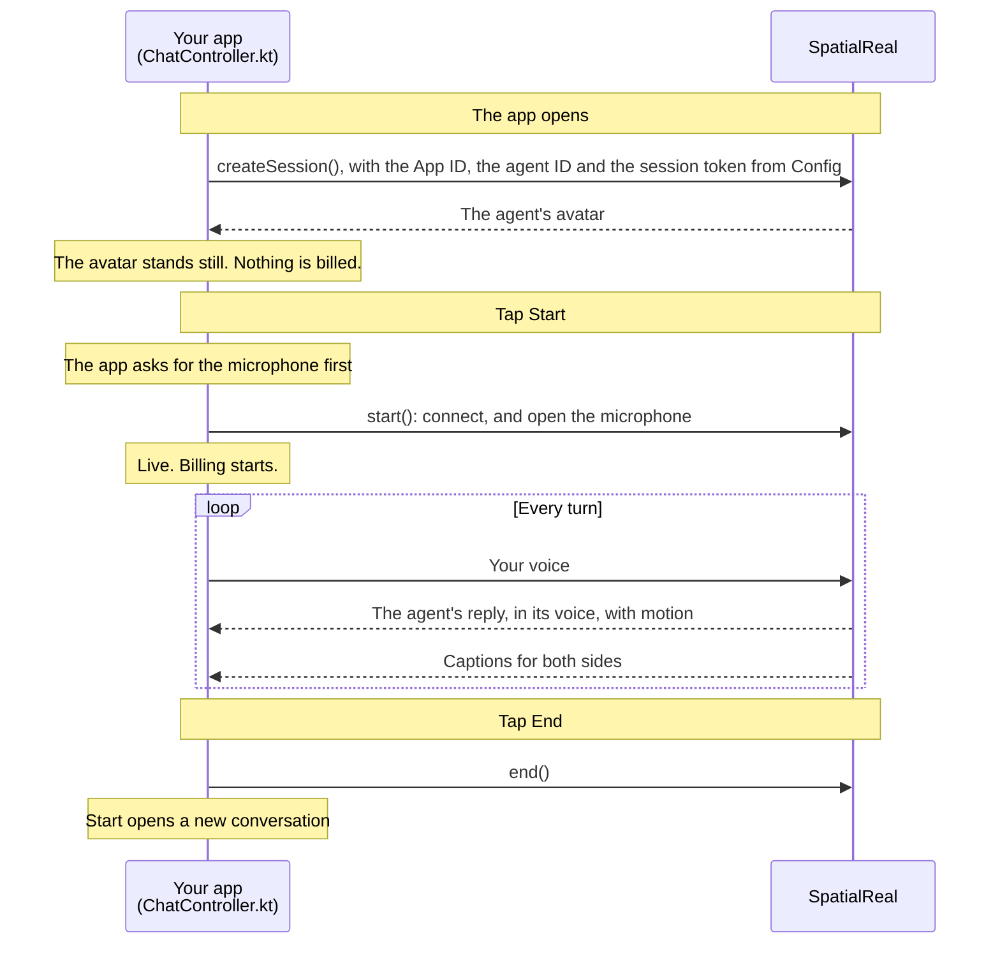

# Agent in an Android app

A Jetpack Compose app with your own interface for a SpatialReal Agent: the Android SDK runs the conversation and shows the agent's avatar, with captions for both sides.

Docs: [Your own app](https://docs.spatialreal.ai/agent/reach/your-own-app) (Android tab)

## Before you start

- Android Studio
- An Android phone or tablet on Android 7.0 (API 24) or later, with a 64-bit ARM processor and Vulkan support
- An agent created in [SpatialReal Studio](https://app.spatialreal.ai), and its **Agent ID**
- The **App ID** of the app the agent runs under ([Apps & API keys](https://docs.spatialreal.ai/studio/api-keys)), and a **temporary session token** ([Session tokens](https://docs.spatialreal.ai/overview/session-tokens#temporary-tokens-for-testing))

## Configure

Open this folder in Android Studio. Gradle fetches the SpatialReal SDK (`ai.spatialreal:android`) on its own.

Fill in `app/src/main/java/ai/spatialreal/examples/agent/Config.kt`:

| Value | What it is |
| --- | --- |
| `APP_ID` | Your App ID |
| `AGENT_ID` | The agent to talk to |
| `SESSION_TOKEN` | A temporary token from Studio. A real app fetches one from its own server, as in [Issue session tokens](https://docs.spatialreal.ai/agent/reach/your-own-app#issue-session-tokens) |

## Run

Connect your device, choose it in Android Studio, and press **Run**. From a terminal:

```bash
./gradlew installDebug
```

## What you should see

1. The agent's avatar appears, standing still. Nothing is billed yet.
2. Tap **Start** and allow the microphone. The session goes `live`, and billing starts.
3. Say something. The agent answers in its voice, lips in sync, and the captions show both sides of the conversation.
4. Tap **End** to finish. **Start** opens a new conversation.

If the agent, a time limit or your credits end the conversation, the app says so and why. It doesn't reconnect on its own.

## How it works



SpatialReal runs the whole conversation: it hears you, writes the reply and speaks it as the agent. The app sends your voice and plays what comes back. A real app fetches the session token from its own server instead of `Config.kt`.

## How it maps to the docs

| Docs step (Android tab) | Where it is |
| --- | --- |
| Install the SDK | `gradle/libs.versions.toml`, `app/build.gradle.kts`, and `INTERNET` / `RECORD_AUDIO` in `AndroidManifest.xml` |
| Add the screen | `ChatScreen` in `MainActivity.kt` |
| Start a conversation | `ChatController.create()`, and `start()` after the microphone prompt |
| Captions | `ChatController.show()`, rendered by `ChatScreen` |
| When a session ends | `ChatController.report()` |
| Clean up | `ChatController.release()`, from `MainActivity.onDestroy()` |

## Something doesn't work?

- **`credential-invalid` when the app opens**: the App ID, token and Agent ID must belong to the same app.
- **`credential-expired`**: the temporary token has run out. Create a new one in Studio.
- **The app says it needs the microphone**: allow it under the app's permissions in **Settings**, then tap **Start** again.

Every error code is listed in [Error codes](https://docs.spatialreal.ai/agent/error-codes).
