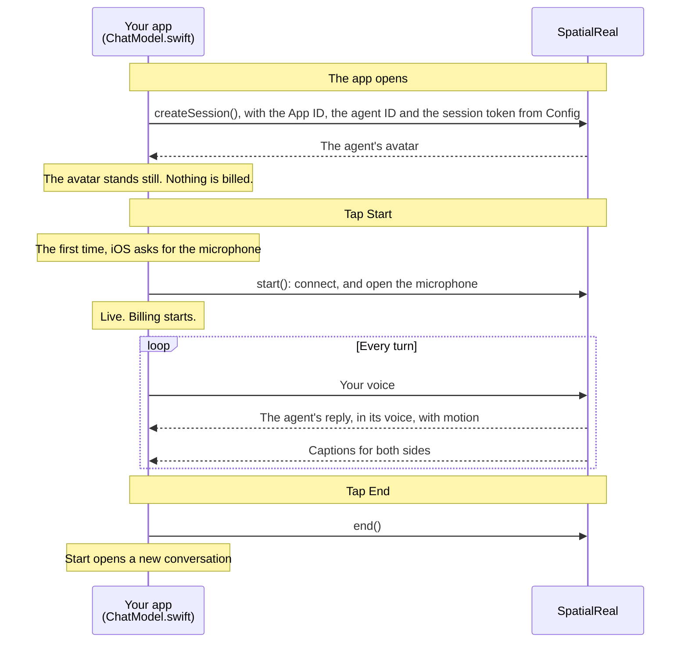

# Agent in an iOS app

A SwiftUI app with your own interface for a SpatialReal Agent: the iOS SDK runs the conversation and shows the agent's avatar, with captions for both sides.

Docs: [Your own app](https://docs.spatialreal.ai/agent/reach/your-own-app) (iOS tab)

## Before you start

- Xcode 16 or later
- An iPhone or iPad on iOS 16 or later (A11 chip or newer). The simulator works too on a Mac with Apple silicon, but without the microphone: to talk to the agent, use a device
- An agent created in [SpatialReal Studio](https://app.spatialreal.ai), and its **Agent ID**
- The **App ID** of the app the agent runs under ([Apps & API keys](https://docs.spatialreal.ai/studio/api-keys)), and a **temporary session token** ([Session tokens](https://docs.spatialreal.ai/overview/session-tokens#temporary-tokens-for-testing))

## Configure

Open `AgentExample.xcodeproj`. Xcode fetches the SpatialReal SDK on its own.

Fill in `AgentExample/Config.swift`:

| Value | What it is |
| --- | --- |
| `appId` | Your App ID |
| `agentId` | The agent to talk to |
| `sessionToken` | A temporary token from Studio. A real app fetches one from its own server, as in [Issue session tokens](https://docs.spatialreal.ai/agent/reach/your-own-app#issue-session-tokens) |

To run on a device, also pick your team under **Signing & Capabilities**.

## Run

Choose a simulator or your device, and press **Run** (⌘R).

## What you should see

1. The agent's avatar appears, standing still. Nothing is billed yet.
2. Tap **Start** and allow the microphone. The session goes `live`, and billing starts.
3. Say something. The agent answers in its voice, lips in sync, and the captions show both sides of the conversation.
4. Tap **End** to finish. **Start** opens a new conversation.

If the agent, a time limit or your credits end the conversation, the app says so and why. It doesn't reconnect on its own.

## How it works

SpatialReal runs the whole conversation: it hears you, writes the reply and speaks it as the agent. The app sends your voice and plays what comes back. A real app fetches the session token from its own server instead of `Config.swift`.

## How it maps to the docs

| Docs step (iOS tab) | Where it is |
| --- | --- |
| Install the SDK | The `SpatialRealSDK` package in the project |
| Microphone usage description | The target's `NSMicrophoneUsageDescription` build setting |
| Start a conversation | `ChatModel.create()`, `start()`, `end()`, `release()` |
| Captions | `ChatModel.show(_:)`, rendered in `ContentView.swift` |
| When a session ends | `ChatModel.report(_:)` |

## Something doesn't work?

- **`credential-invalid` when the app opens**: the App ID, token and Agent ID must belong to the same app.
- **`credential-expired`**: the temporary token has run out. Create a new one in Studio.
- **`mic-denied`**: allow the microphone for the app in **Settings**, then tap **Start** again.

Every error code is listed in [Error codes](https://docs.spatialreal.ai/agent/error-codes).
