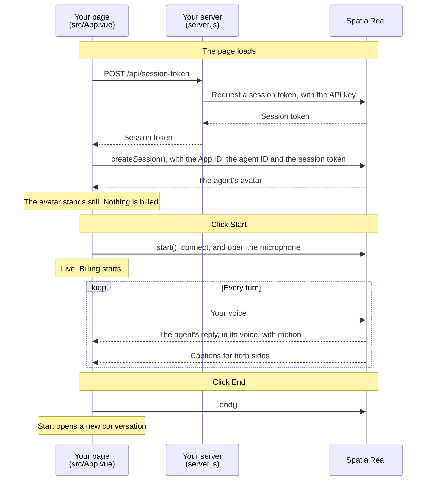

# Agent in your own interface

A web page with your own interface for a SpatialReal Agent: the Web SDK runs the conversation and shows the agent's avatar, and a small server issues session tokens.

Docs: [Your own app](https://docs.spatialreal.ai/agent/reach/your-own-app)

## Before you start

- Node.js 20.19 or later
- An agent created in [SpatialReal Studio](https://app.spatialreal.ai), and its **Agent ID**
- The **App ID** and **API key** of the app the agent runs under — see [Apps & API keys](https://docs.spatialreal.ai/studio/api-keys)
- A microphone

## Configure

```bash
cp .env.example .env
```

Fill in `.env`:

| Variable | What it is |
| --- | --- |
| `VITE_SPATIALREAL_APP_ID` | Your App ID |
| `VITE_SPATIALREAL_AGENT_ID` | The agent to talk to |
| `SPATIALREAL_API_KEY` | Your API key. Only `server.js` reads it; it never reaches the browser |

## Run

```bash
npm install
npm run dev
```

Open http://localhost:5173.

## What you should see

1. The agent's avatar appears, standing still. Nothing is billed yet.
2. Click **Start** and allow the microphone. The session goes `live`, and billing starts.
3. Say something. The agent answers in its voice, lips in sync, and the captions show both sides of the conversation.
4. Click **End** to finish. **Start** opens a new conversation.

If the agent, a time limit or your credits end the conversation, the page says so and why. It doesn't reconnect on its own.

## How it works



SpatialReal runs the whole conversation: it hears you, writes the reply and speaks it as the agent. The page sends your voice and plays what comes back. The API key stays in `server.js`.

## How it maps to the docs

| Docs section | Where it is |
| --- | --- |
| Issue session tokens | `server.js` |
| Install the SDK, and add the SpatialReal plugin | `package.json`, `vite.config.ts` |
| Start a conversation | `src/App.vue` — `onMounted`, `start()`, `end()`, `release()` |
| Show captions and state | `src/App.vue` — `showLine()`, and the `state` and `error` listeners |
| When a session ends | `src/App.vue` — the `error` listener |

## Something doesn't work?

- **The page shows an error from the token server**: check `SPATIALREAL_API_KEY` in `.env`.
- **`credential-invalid` when the page loads**: the App ID, API key and Agent ID must belong to the same app.
- **`mic-denied`**: allow the microphone for `localhost` in your browser's site settings, then click **Start** again.

Every error code is listed in [Error codes](https://docs.spatialreal.ai/agent/error-codes).
