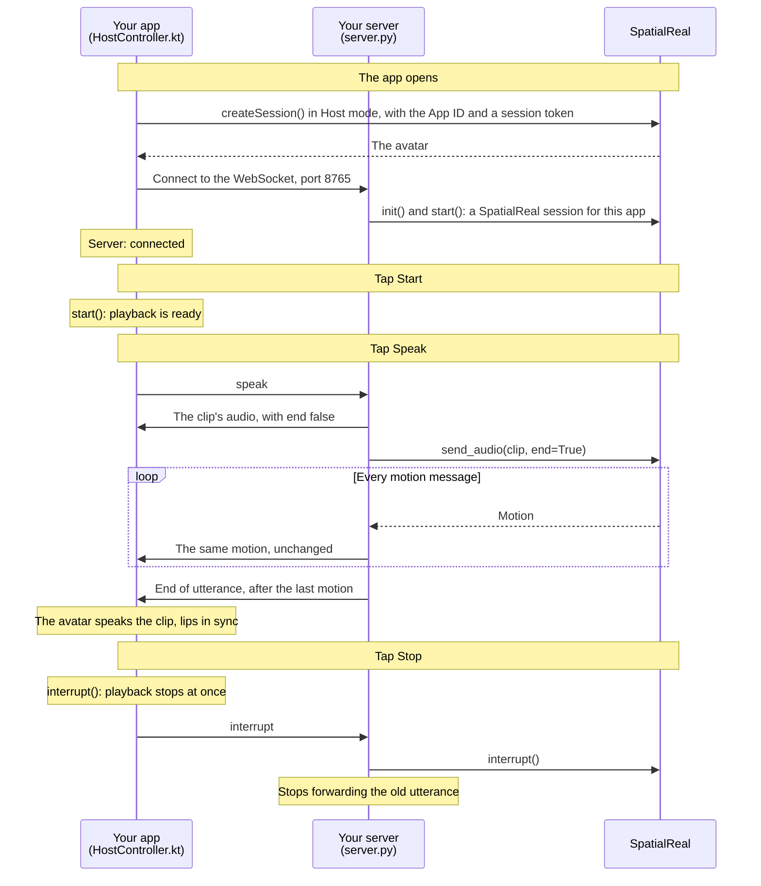

# Host mode client (Android)

A Jetpack Compose app that connects to your Host mode server and plays the audio and motion it forwards. The avatar speaks with lip-sync and expressions; the app itself opens no connection to SpatialReal.

Docs: [Host mode client](https://docs.spatialreal.ai/avatar-integration/host-mode/client) (Android tab)

This is an app side of the Host mode example. Start the server in [`../../server`](../../server) first.

## Before you start

- Android Studio
- An Android phone or tablet on Android 7.0 (API 24) or later, with a 64-bit ARM processor and Vulkan support, on the same network as your computer
- The Host mode server from [`../../server`](../../server), running with `HOST=0.0.0.0` so the phone can reach it
- From [SpatialReal Studio](https://app.spatialreal.ai): your **App ID** ([Apps & API keys](https://docs.spatialreal.ai/studio/api-keys)), the same **avatar ID** the server uses, and a **temporary session token** ([Session tokens](https://docs.spatialreal.ai/overview/session-tokens#temporary-tokens-for-testing))

## Configure

Open this folder in Android Studio. Gradle fetches the SpatialReal SDK (`ai.spatialreal:android`) on its own.

Fill in `app/src/main/java/ai/spatialreal/examples/hostclient/Config.kt`:

| Value | What it is |
| --- | --- |
| `APP_ID` | Your App ID |
| `AVATAR_ID` | The avatar the server uses |
| `SESSION_TOKEN` | A temporary token from Studio, used only to download the avatar |
| `HOST_SERVER_URL` | Your computer's address on the network, for example `ws://192.168.1.20:8765` |

## Run

Connect your device, choose it in Android Studio, and press **Run**. From a terminal:

```bash
./gradlew installDebug
```

## What you should see

1. The avatar appears, standing still, and the app shows **Server: connected**.
2. Tap **Start**.
3. Tap **Speak (female voice)** or **Speak (male voice)**, whichever suits your avatar. The server sends the clip to SpatialReal and forwards the audio and motion; the avatar speaks it, lips in sync.
4. Tap **Stop** while it speaks: it stops at once, and the server stops forwarding.

The messages are the same as in the [web client](../web#messages).

## How it works



The app downloads the avatar from SpatialReal and opens no other connection to it. Everything else (the audio, the motion and the end of each utterance) reaches the app through your server, in order.

## How it maps to the docs

| Docs step (Android tab) | Where it is |
| --- | --- |
| Install the SDK, and OkHttp | `gradle/libs.versions.toml`, `app/build.gradle.kts` |
| Create a Host mode session | `HostController.create()`, once the container is laid out |
| Hand over what your server sends | `HostController.connect()`: one message at a time, in order |
| Start, then ask for speech | `HostController.start()`, `speak()` |
| Interrupt and clean up | `HostController.stop()`, `release()` |

`usesCleartextTraffic` in `AndroidManifest.xml` lets the app reach the example server over plain `ws://`. A production app talks to its server over `wss://` and drops it.

## Something doesn't work?

See [Common problems](https://docs.spatialreal.ai/avatar-integration/host-mode/client#common-problems). If the app says **Can't reach the server**, check that the server runs with `HOST=0.0.0.0`, that the phone is on the same network, and that `HOST_SERVER_URL` has your computer's address.
