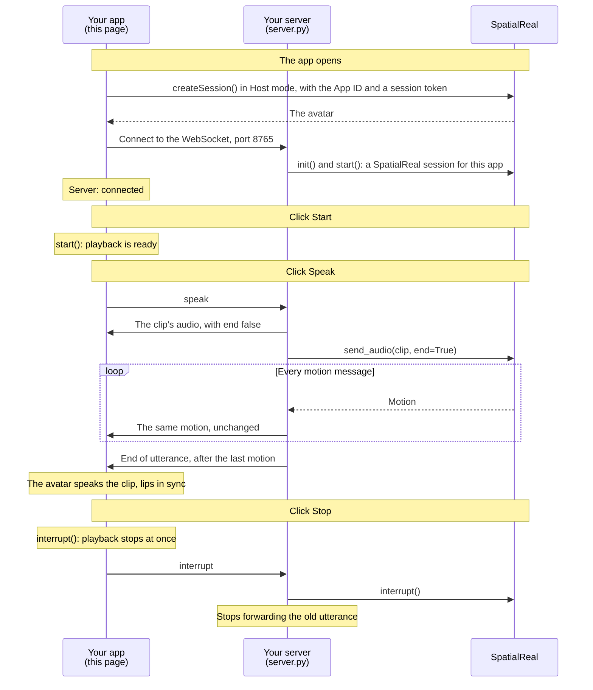

# Host mode client (Web)

A web page that connects to your Host mode server and plays the audio and motion it forwards. The avatar speaks with lip-sync and expressions; the page itself opens no connection to SpatialReal.

Docs: [Host mode client](https://docs.spatialreal.ai/avatar-integration/host-mode/client)

This is an app side of the Host mode example; the same app is in [`../ios`](../ios) and [`../android`](../android). Start the server in [`../../server`](../../server) first.

## Before you start

- Node.js 20.19 or later
- The Host mode server from [`../../server`](../../server), running
- From [SpatialReal Studio](https://app.spatialreal.ai): your **App ID** and **API key** ([Apps & API keys](https://docs.spatialreal.ai/studio/api-keys)), and the same **avatar ID** the server uses

## Configure

```bash
cp .env.example .env
```

Fill in `.env`:

| Variable | What it is |
| --- | --- |
| `VITE_SPATIALREAL_APP_ID` | Your App ID |
| `VITE_SPATIALREAL_AVATAR_ID` | The avatar the server uses |
| `VITE_HOST_SERVER_URL` | Your Host mode server. `ws://localhost:8765` for the example server |
| `SPATIALREAL_API_KEY` | Your API key. Only `server.js` reads it, to issue the token that downloads the avatar |

## Run

```bash
npm install
npm run dev
```

Open http://localhost:5173.

## What you should see

1. The avatar appears, standing still, and the page shows **Server: connected**.
2. Click **Start**.
3. Click **Speak (female voice)** or **Speak (male voice)**, whichever suits your avatar. The server sends the clip to SpatialReal and forwards the audio and motion; the avatar speaks it, lips in sync.
4. Click **Stop** while it speaks: it stops at once, and the server stops forwarding.

## How it works



The app downloads the avatar from SpatialReal and opens no other connection to it. Everything else (the audio, the motion and the end of each utterance) reaches the app through your server, in order.

## Messages

The page and the server exchange JSON over the WebSocket:

| From → to | Message |
| --- | --- |
| This page → the Host mode server | `{"type": "speak", "voice": "female"}` or `"male"`, and `{"type": "interrupt"}` |
| The Host mode server → this page | `{"type": "audio", "data": "<base64 PCM16>", "end": false}` |
| The Host mode server → this page | `{"type": "motion", "data": ["<base64>", ...]}` |
| The Host mode server → this page | `{"type": "audio", "data": "", "end": true}`: the end of the utterance, after its last motion |

## How it maps to the docs

| Docs step (Web tab) | Where it is |
| --- | --- |
| Install the SDK | `package.json`, `vite.config.ts` |
| Add a place for the avatar | `src/App.vue` — the `.avatar` element |
| Create a Host mode session | `src/App.vue` — `onMounted` |
| Hand over what your server sends | `src/App.vue` — `connect()` |
| Start on a click, then ask for speech | `src/App.vue` — `start()`, `speak()` |
| Interrupt and clean up | `src/App.vue` — `stop()`, `release()` |

`server.js` only issues the session token that downloads the avatar; it is not the Host mode server.

## Something doesn't work?

See [Common problems](https://docs.spatialreal.ai/avatar-integration/host-mode/client#common-problems). If the page says **Server: not connected**, check that the Host mode server is running and that `VITE_HOST_SERVER_URL` points to it.
