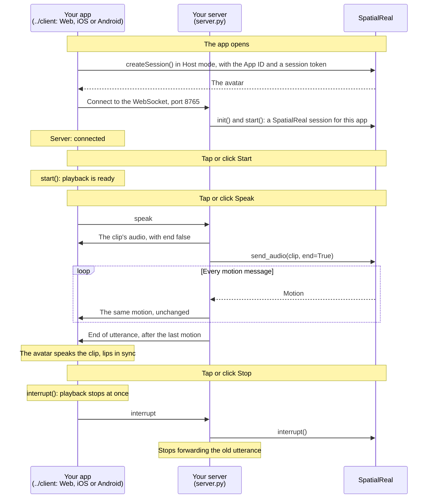

# Host mode server

A Python server that, when the app asks, sends an audio clip to SpatialReal and forwards both the clip's audio and the avatar's motion to the app over a WebSocket. In your system the speech comes from your voice agent; everything else stays the same.

Docs: [Host mode server](https://docs.spatialreal.ai/avatar-integration/host-mode/server)

This is the server side of the Host mode example. The app side is in [`../client`](../client): Web, iOS or Android.

## Before you start

- Python 3.10 or later, and [uv](https://docs.astral.sh/uv/)
- From [SpatialReal Studio](https://app.spatialreal.ai): your **App ID** and **API key** ([Apps & API keys](https://docs.spatialreal.ai/studio/api-keys)), and an **avatar ID** ([Avatar library](https://docs.spatialreal.ai/studio/public-avatar))

## Configure

```bash
cp .env.example .env
```

Fill in `SPATIALREAL_API_KEY`, `SPATIALREAL_APP_ID` and `SPATIALREAL_AVATAR_ID`. The API key stays on this server.

## Run

```bash
uv run server.py
```

The server listens on `ws://localhost:8765`. Leave it running, and start a client with the same avatar ID: [Web](../client/web), [iOS](../client/ios) or [Android](../client/android).

To reach it from a phone, start it with `HOST=0.0.0.0` in `.env`, and point the app at your computer's address on the network, for example `ws://192.168.1.20:8765`.

## What you should see

- When the app connects, the server prints `App connected; SpatialReal session started`.
- When the app asks for speech, audio and motion messages flow to it, and the avatar speaks the clip, lips in sync.
- When the app interrupts, the server stops forwarding the old utterance at once.

## How it works



The app downloads the avatar from SpatialReal and opens no other connection to it. Everything else (the audio, the motion and the end of each utterance) reaches the app through your server, in order.

## Messages

JSON over the WebSocket, with binary data in base64:

| Message | From → to | Example |
| --- | --- | --- |
| Audio | This server → the app | `{"type": "audio", "data": "<base64>", "end": false}` |
| End of utterance | This server → the app | `{"type": "audio", "data": "", "end": true}`, after the utterance's last motion |
| Motion | This server → the app | `{"type": "motion", "data": ["<base64>"]}` |
| Speak | The app → this server | `{"type": "speak", "voice": "female"}`, or `"male"` |
| Interrupt | The app → this server | `{"type": "interrupt"}` |

The clips in `clips/` are 16 kHz mono speech: one female voice, one male voice. Pick the one that suits your avatar.

## How it maps to the docs

| Docs step | Where it is in `server.py` |
| --- | --- |
| Open a SpatialReal session for each app | `handle()` — `new_avatar_session`, `init()`, `start()`, and `on_motion` |
| Forward the audio, then send it to SpatialReal | `speak()` |
| Stop when the app interrupts | `listen()` — the `interrupt` branch |

## Something doesn't work?

- **`KeyError: 'SPATIALREAL_API_KEY'`**: `.env` is missing or incomplete.
- **The app connects but the avatar never speaks**: the app and the server must use the same avatar ID.

Errors from SpatialReal are printed as `SpatialReal error: …`. See [Errors & recovery](https://docs.spatialreal.ai/avatar-integration/errors-and-recovery).
