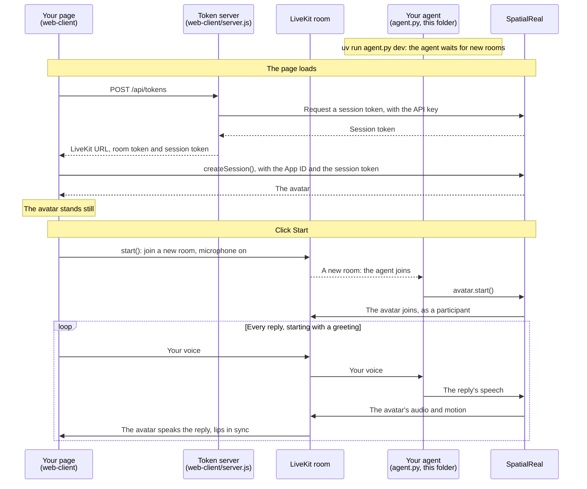

# LiveKit agent

A LiveKit Agents voice agent in Python with the SpatialReal plugin: whatever the agent says, the avatar speaks in the room, with lip-sync and expressions.

Docs: [LiveKit Agent](https://docs.spatialreal.ai/avatar-integration/livekit/agent)

This is one half of the LiveKit example. The other half, the page users talk from, is in [`../web-client`](../web-client).

## Before you start

- Python 3.11 or later, and [uv](https://docs.astral.sh/uv/)
- A [LiveKit](https://livekit.io) project: its URL, API key and API secret
- From [SpatialReal Studio](https://app.spatialreal.ai): your **App ID** and **API key** ([Apps & API keys](https://docs.spatialreal.ai/studio/api-keys)), and an **avatar ID** ([Avatar library](https://docs.spatialreal.ai/studio/public-avatar))
- API keys for the voice pipeline: [Deepgram](https://deepgram.com) (speech to text), [OpenAI](https://platform.openai.com) (the replies) and [Cartesia](https://cartesia.ai) (text to speech)

## Configure

```bash
cp .env.example .env
```

Fill in `.env`:

| Variable | What it is |
| --- | --- |
| `SPATIALREAL_API_KEY`, `SPATIALREAL_APP_ID` | Your SpatialReal API key and App ID |
| `SPATIALREAL_AVATAR_ID` | The avatar that speaks for the agent |
| `LIVEKIT_URL`, `LIVEKIT_API_KEY`, `LIVEKIT_API_SECRET` | Your LiveKit project |
| `DEEPGRAM_API_KEY`, `OPENAI_API_KEY`, `CARTESIA_API_KEY` | The voice pipeline |

## Run

```bash
uv run agent.py dev
```

The agent registers with your LiveKit project and joins every new room. Now start the [web client](../web-client) with the same avatar ID, click **Start** and speak.

## What you should see

- When a user joins a room, the agent joins too, and so does the avatar, as a participant publishing the avatar's audio and motion.
- The agent greets the user. Then, whatever it says, the avatar speaks, lips in sync.

## How it works



Your agent never talks to the page directly: everything goes through the LiveKit room. The SpatialReal plugin turns the agent's speech into the avatar, and the avatar joins the room like any other participant.

## How it maps to the docs

| Docs step | Where it is in `agent.py` |
| --- | --- |
| Install | `pyproject.toml` |
| Configure | `.env`: the plugin reads the `SPATIALREAL_*` variables |
| Start the avatar with your agent session | `entrypoint()` — `spatialreal.AvatarSession()` and `avatar.start()`, before `session.start()` |
| Run the agent | `uv run agent.py dev` |

The rest of `agent.py` is an ordinary LiveKit Agents voice agent: swap in your own speech-to-text, model and text-to-speech, or a realtime model, and the avatar keeps working.

## Something doesn't work?

- **The avatar never joins the room**: read the agent's log; the plugin reports why the avatar couldn't start. Check the `SPATIALREAL_*` values.
- **The agent never joins the room**: the agent and the web client must use the same LiveKit project.
