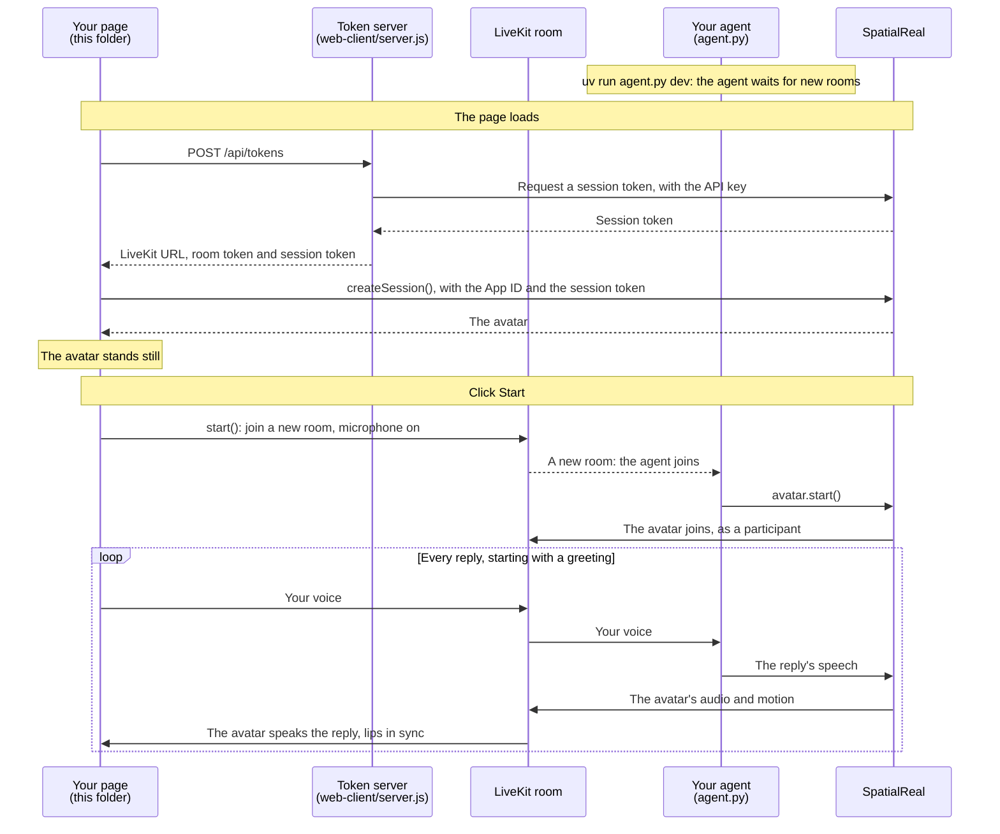

# LiveKit web client

A web page that joins your LiveKit room, sends the user's microphone to your agent, and renders the avatar that speaks the agent's replies.

Docs: [LiveKit web client](https://docs.spatialreal.ai/avatar-integration/livekit/web-client)

This is one half of the LiveKit example. Run the agent in [`../agent`](../agent) first, on the same LiveKit project.

## Before you start

- Node.js 20.19 or later
- The agent from [`../agent`](../agent), running
- A [LiveKit](https://livekit.io) project: its URL, API key and API secret
- From [SpatialReal Studio](https://app.spatialreal.ai): your **App ID** and **API key** ([Apps & API keys](https://docs.spatialreal.ai/studio/api-keys)), and the same **avatar ID** your agent uses
- A microphone

## Configure

```bash
cp .env.example .env
```

Fill in `.env`:

| Variable | What it is |
| --- | --- |
| `VITE_SPATIALREAL_APP_ID` | Your App ID |
| `VITE_SPATIALREAL_AVATAR_ID` | The avatar your agent uses |
| `SPATIALREAL_API_KEY` | Your SpatialReal API key. Only `server.js` reads it |
| `LIVEKIT_URL` | Your LiveKit server URL (`wss://…`) |
| `LIVEKIT_API_KEY`, `LIVEKIT_API_SECRET` | Your LiveKit API key and secret. Only `server.js` reads them |

## Run

```bash
npm install
npm run dev
```

Open http://localhost:5173.

## What you should see

1. The avatar appears, standing still.
2. Click **Start** and allow the microphone. The page joins a new room, and your agent joins it too.
3. Speak. Your agent hears you, and the avatar speaks its reply, lips in sync.
4. **Mute** stops sending your microphone; **Leave** leaves the room and keeps the avatar on screen.

Every page load gets its own room, so two tabs don't talk over each other.

## How it works



Your agent never talks to the page directly: everything goes through the LiveKit room. The SpatialReal plugin turns the agent's speech into the avatar, and the avatar joins the room like any other participant.

## How it maps to the docs

| Docs step | Where it is |
| --- | --- |
| Install | `package.json`, `vite.config.ts` |
| Hand out two tokens from your server | `server.js` — `POST /api/tokens` |
| Create the session | `src/App.vue` — `onMounted` |
| Join the room on a click | `src/App.vue` — `start()` |
| Recover and clean up | `src/App.vue` — the `stalled` listener, `toggleMute()`, `leave()`, `release()` |

## Something doesn't work?

See [Common problems](https://docs.spatialreal.ai/avatar-integration/livekit/web-client#common-problems). If the avatar never speaks, check the agent's terminal: it must be running with the SpatialReal plugin, on the same LiveKit project.
