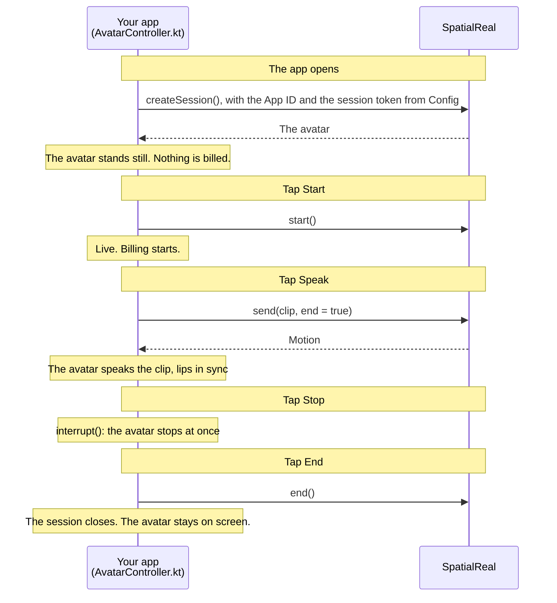

# SDK mode on Android

A Jetpack Compose app where the avatar speaks an audio clip: the app sends the clip to SpatialReal, and the avatar speaks it with lip-sync and expressions.

Docs: [SDK mode on Android](https://docs.spatialreal.ai/avatar-integration/sdk-mode/android)

## Before you start

- Android Studio
- An Android phone or tablet on Android 7.0 (API 24) or later, with a 64-bit ARM processor and Vulkan support
- From [SpatialReal Studio](https://app.spatialreal.ai): your **App ID** ([Apps & API keys](https://docs.spatialreal.ai/studio/api-keys)), an **avatar ID** ([Avatar library](https://docs.spatialreal.ai/studio/public-avatar)) and a **temporary session token** ([Session tokens](https://docs.spatialreal.ai/overview/session-tokens#temporary-tokens-for-testing))

## Configure

Open this folder in Android Studio. Gradle fetches the SpatialReal SDK (`ai.spatialreal:android`) on its own.

Fill in `app/src/main/java/ai/spatialreal/examples/sdkmode/Config.kt`:

| Value | What it is |
| --- | --- |
| `APP_ID` | Your App ID |
| `AVATAR_ID` | The avatar to show |
| `SESSION_TOKEN` | A temporary token from Studio. A real app fetches one from its own server |

## Run

Connect your device, choose it in Android Studio, and press **Run**. From a terminal:

```bash
./gradlew installDebug
```

## What you should see

1. The avatar appears, standing still. Nothing is billed yet.
2. Tap **Start**. The session goes `live`, and billing starts.
3. Tap **Speak (female voice)** or **Speak (male voice)**, whichever suits your avatar. The avatar speaks the clip, lips in sync, and returns to idle when it ends.
4. Tap **Stop** while it speaks: it stops at once. **End** closes the session and keeps the avatar on screen.

## How it works



Here the session token comes from `Config.kt`. A real app fetches it from its own server, so the API key never ships inside the app.

## How it maps to the docs

| Docs step | Where it is |
| --- | --- |
| Install the SDK | `gradle/libs.versions.toml`, `app/build.gradle.kts`, and `INTERNET` in `AndroidManifest.xml` |
| Add a place for the avatar | `AvatarController.container`, shown by `AndroidView` in `MainActivity.kt` |
| Create the session | `AvatarController.create()`, once the container is laid out |
| Start the session | `AvatarController.start()` |
| Make the avatar speak | `AvatarController.speak()`, with the clip read by `AudioClip.pcm16()` |
| Stop and clean up | `AvatarController.stop()`, `end()`, `release()` |

The clips in `app/src/main/assets/` are 16 kHz mono speech: one female voice, one male voice.

## Something doesn't work?

See [Common problems](https://docs.spatialreal.ai/avatar-integration/sdk-mode/android#common-problems). A `credential-expired` error means the temporary token has run out: create a new one in Studio.
