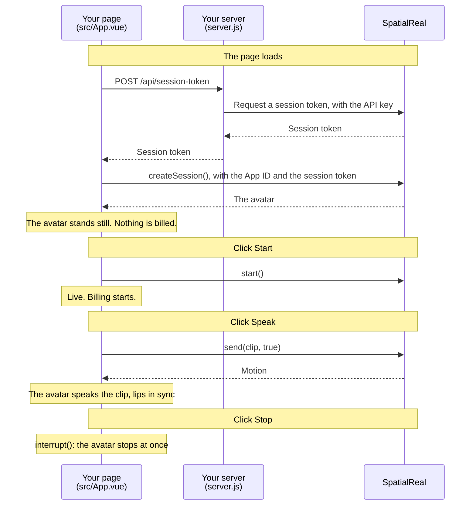

# SDK mode on the Web

A web page where the avatar speaks an audio clip: the page sends the clip to SpatialReal, and the avatar speaks it with lip-sync and expressions.

Docs: [SDK mode on the Web](https://docs.spatialreal.ai/avatar-integration/sdk-mode/web)

## Before you start

- Node.js 20.19 or later
- From [SpatialReal Studio](https://app.spatialreal.ai): your **App ID** and **API key** ([Apps & API keys](https://docs.spatialreal.ai/studio/api-keys)), and an **avatar ID** ([Avatar library](https://docs.spatialreal.ai/studio/public-avatar))

## Configure

```bash
cp .env.example .env
```

Fill in `.env`:

| Variable | What it is |
| --- | --- |
| `VITE_SPATIALREAL_APP_ID` | Your App ID |
| `VITE_SPATIALREAL_AVATAR_ID` | The avatar to show |
| `SPATIALREAL_API_KEY` | Your API key. Only `server.js` reads it; it never reaches the browser |

## Run

```bash
npm install
npm run dev
```

Open http://localhost:5173.

## What you should see

1. The avatar appears, standing still. Nothing is billed yet.
2. Click **Start**. The session goes `live`, and billing starts.
3. Click **Speak (female voice)** or **Speak (male voice)**, whichever suits your avatar. The avatar speaks the clip, lips in sync, and returns to idle when it ends.
4. Click **Stop** while it speaks: it stops at once.

## How it works



The API key stays in `server.js`. The page only ever holds the session token.

## How it maps to the docs

| Docs step | Where it is |
| --- | --- |
| Install the SDK, and add the SpatialReal plugin | `package.json`, `vite.config.ts` |
| Add a place for the avatar | `src/App.vue` — the `.avatar` element (sized in `src/style.css`) |
| Create the session | `src/App.vue` — `onMounted` |
| Start the session on a click | `src/App.vue` — `start()` |
| Turn the file into audio the SDK accepts | `src/App.vue` — `loadPcm16()` |
| Make the avatar speak | `src/App.vue` — `speak()` |
| Stop and clean up | `src/App.vue` — `stop()`, `release()` |
| Your token endpoint | `server.js` |

The clips in `public/` are 16 kHz mono speech: one female voice, one male voice.

## Something doesn't work?

See [Common problems](https://docs.spatialreal.ai/avatar-integration/sdk-mode/web#common-problems). If the page shows an error from the token server, check `SPATIALREAL_API_KEY` in `.env`.
